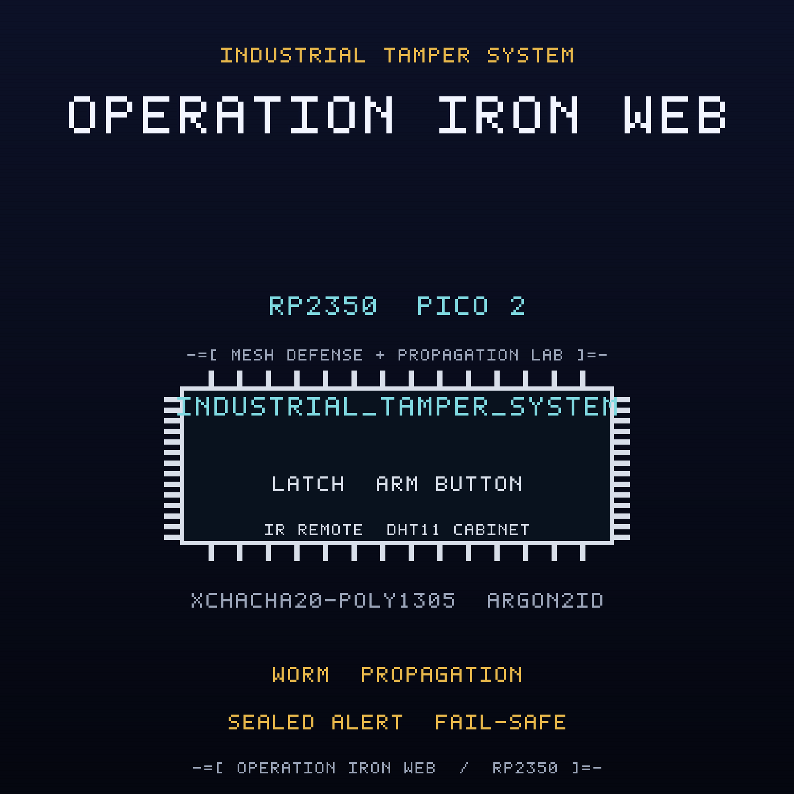

<br>

## FREE Reverse Engineering Self-Study Course [HERE](https://github.com/mytechnotalent/reverse-engineering)
## FREE Embedded Hacking Course [HERE](https://github.com/mytechnotalent/Embedded-Hacking)

<br>

# OPERATION IRON WEB CTF

### Act V - The compromised industrial tamper system

<br>

***
**LEGAL DISCLAIMER:**
The information, tools, and code provided in this repository and course are strictly for educational, research, and defensive purposes only. 

You are explicitly prohibited from using any materials contained herein to access, test, modify, or exploit any device, network, or system that you do not own 100% or for which you do not have explicit, documented, and legally binding authorization to interact with.

By using this repository and course, you acknowledge and agree that:

1. Any illegal, unauthorized, or malicious use of this information is solely your responsibility.
2. The author(s) and contributor(s) of this repository and course shall not be held liable for any damages, legal repercussions, criminal charges, or unauthorized actions resulting from the use, misuse, or abuse of the contents herein.
3. You will comply with all applicable local, state, national, and international laws regarding cybersecurity and computer fraud.

**IF YOU DO NOT AGREE WITH THESE TERMS, DO NOT USE THIS REPOSITORY AND COURSE.**
***

<br>
<br>

> Hello again, friend.
>
> Act I was the lie. Act II was the door. Act III was the payload. Act IV was the
> payload that would not die. This is the payload that spreads.
>
> WHITEOUT pulled the HVAC node. The crew erased the reserved sector and cut the
> persistence on the bench, and it should have ended there. It did not. The
> tamper system is not one board. It is a mesh: a ring of chassis-intrusion nodes
> watching the cabinets where NorthPharma stores what it does not want inspected.
> FROSTLINE did not hide a bomb in one of them. It wrote a worm.
>
> The implant listens on the LoRa band for a magic frame. When it hears IRONWEB,
> it reports itself infected and re-emits the same frame to the next node it can
> reach. One node is enough. Touch one, and the mesh carries it the rest of the
> way.
>
> NorthPharma is the Ministry's front. FROSTLINE wrote the web.
>
> Do not chase the nodes one at a time. Cut the web. Then seal the alert path so
> it cannot grow back.
>
> The green lamp is lit on every node but one. That is exactly the problem.

This is the companion capture-the-flag to the
[industrial-tamper-system](https://github.com/mytechnotalent/industrial-tamper-system)
project. Where the project builds the defended node, this CTF hands you the
**compromised** image that FROSTLINE shipped and asks you to find every defect,
prove it on real hardware, and patch the image.

<br>

## THE MISSION

The `ACT-V.bin` image is the OPERATION IRON WEB industrial tamper system with
**four deliberate defects**. Each defect is an in-place, same-size byte patch, so
no address moves when you fix it. Every fix is provable on a Pico 2 with a Debug
Probe.

| # | Name | What FROSTLINE did |
| - | ---- | ------------------ |
| 1 | The Worm Payload | inverted the payload gate so receipt of the `IRONWEB` magic frame arms the handler and the node infects itself |
| 2 | The Propagation Gate | inverted the propagation gate so an infected node re-broadcasts the worm to its peers every 4 ticks |
| 3 | The Infection Marker | inverted the marker gate so the first boot writes marker `0xC7` to reserved sector `0x103FF000` |
| 4 | The Tamper Authorization | inverted the authorization verdict so an unauthenticated or replayed tamper envelope is accepted |

The wire is sealed with XChaCha20-Poly1305, keyed through Argon2id. The
cryptography is correct. Three of the four defects are not in the cipher at all:
they are an implant that listens to the raw mesh before the envelope is ever
opened and spreads itself to every peer. The fourth is a policy seam in the
tamper command path. Read the dead, find the payload, and cut the web.

<br>

## THE ARTIFACTS

| File | Role | SHA-256 |
| ---- | ---- | ------- |
| `ACT-V.bin` | compromised firmware, the target | `fab47a6e9f81aaccbc01baffb02ae56d98cc70974e82caa256beb6c52bbb4577` |
| `ACT-V.uf2` | flashable image of the target | `4eac898720e7fc3663a1b5d2b047318230b98a02f7d7a83a0774cc605dc67278` |
| `ACT-V_fixed.bin` | corrected firmware, the solution | `795fe72e417cfa28bf61196358eb570c18e7f54f655ca90095b4935b1b362fdc` |
| `ACT-V_fixed.uf2` | flashable image of the solution | `fa0809d6a72561e727790981629eb7028006af03f396b875df9e0e720feb36b1` |

The two `.bin` files differ in exactly four bytes at offsets
`0x7569, 0xA2F7, 0xA35F, 0xA473`, and both are 51,156 bytes. The UF2 images are
102,912 bytes.

<br>

## THE DOCUMENTS

| Document | For |
| -------- | --- |
| [`ACT-V-I.md`](ACT-V-I.md) | Student instructions: the scenario, the tasks, the wiring |
| [`ACT-V-R.md`](ACT-V-R.md) | Requirements and grading criteria |
| [`ACT-V-S.md`](ACT-V-S.md) | Instructor solution key with exact offsets and bytes |
| [`ACT-V-main-disasm.txt`](ACT-V-main-disasm.txt) | Annotated disassembly of the four sabotage sites |
| [`DESIGN.md`](DESIGN.md) | Build blueprint (instructor eyes only) |

<br>

## HARDWARE

Everything runs on the Embedded Hacking breadboard, and the pin map is identical
to Acts I, II, III, and IV so one board serves the whole foundation: a Pico 2, a
Debug Probe, a DHT11 cabinet temperature sensor on GP4, a 1602 I2C LCD tamper
readout on GP2/GP3 at address `0x27`, three annunciator LEDs (red GP16 INTRUSION,
yellow GP17 ARMED, green GP18 SECURE), a manual arm button on GP15, an SG90
shutter latch servo on GP14 with a 1000uF cap, a VS1838B infrared local
arm/disarm remote on GP5, and an RYLR998 LoRa tamper mesh link on UART1 GP8/GP9.
The Debug Probe is effectively required: the anti-debug trap is part of the
exercise. The pin map is in the instructions.

The cryptographic model is carried over from the earlier acts: Argon2id (`t=3`,
`p=1`, `m=64`) derives the field key, XChaCha20-Poly1305 seals every tamper
command, and the anti-replay sequence window and authenticated-state tag are
reused unchanged. The implant is compiled only under `SANDBOX_ONLY`, which the
CTF build defines.

<br>

## QUICK START

Verify the two images against the expected patches and hashes:

```bash
python3 scripts/verify_ctf.py
```

Expected:

```text
10/10 checks passed
```

Build the corrected firmware from source:

```bash
rm -rf build && cmake -S . -B build -G Ninja -DPICO_BOARD=pico2 -DPICO_PLATFORM=rp2350-arm-s -DSANDBOX_ONLY=ON && cmake --build build
```

Run the firmware code standard audit:

```bash
python3 scripts/audit_c_standard.py
```

<br>

## REPOSITORY LAYOUT

```text
ACT-V-I.md               student instructions
ACT-V-R.md               requirements and grading criteria
ACT-V-S.md               instructor solution key
ACT-V.bin / .uf2         compromised artifact
ACT-V_fixed.bin / .uf2   corrected artifact
ACT-V-main-disasm.txt    annotated sabotage sites
scripts/verify_ctf.py    machine verifier
scripts/spoof.py         forged and replayed command injection
src/  include/           firmware sources
CMakeLists.txt           Pico SDK build
DESIGN.md                build blueprint
```

<br>

## WHERE THIS FITS: OPERATION COLD IRON

This is the companion CTF for **Act V (IRON WEB)** of the ten-act OPERATION
COLD IRON saga. The malware track began in Act III; in Act IV it became
persistence, and here it becomes propagation. Act V is the act that teaches why
containment has to break the spread, clear the marker, and seal the command path.
The project it attacks is
[industrial-tamper-system](https://github.com/mytechnotalent/industrial-tamper-system).

- Previous act: Act IV, IRON LUNG, the HVAC automation node,
  [hvac-automation-node](https://github.com/mytechnotalent/hvac-automation-node)
- This act: Act V, IRON WEB, the industrial tamper system
- Next act: Act VI, IRON COURIER, smart-logistics-dropbox (forthcoming)

<br>

## THE MINISTRY

The Ministry runs the state: the surveillance, the cold chain, the gates, the
pipelines, the air, and the cabinets that hold what the state does not discuss.
NorthPharma is one of its deniable industrial fronts, and FROSTLINE is the
contractor that does the work no Ministry letterhead will admit to. FROSTLINE did
not break into this node; it built the worm, taught it to listen for a magic
frame and to hand the frame to its neighbors, signed the image, and moved on.
Against them is WHITEOUT, and the engineer who copied the first image,
NIGHTINGALE. This act is one ring of the Ministry's industrial edge. TELESCREEN,
the surveillance backbone that watches it, comes after the ten.

- Project repository: [github.com/mytechnotalent/industrial-tamper-system](https://github.com/mytechnotalent/industrial-tamper-system)
- This CTF repository: [github.com/mytechnotalent/CTF_industrial-tamper-system](https://github.com/mytechnotalent/CTF_industrial-tamper-system)

<br>

# Next
[OPERATION IRON COURIER](https://github.com/mytechnotalent/smart-logistics-dropbox)

<br>

# License
[MIT License](https://github.com/mytechnotalent/CTF_industrial-tamper-system/blob/main/LICENSE)
